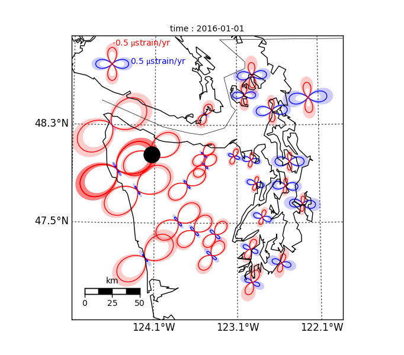
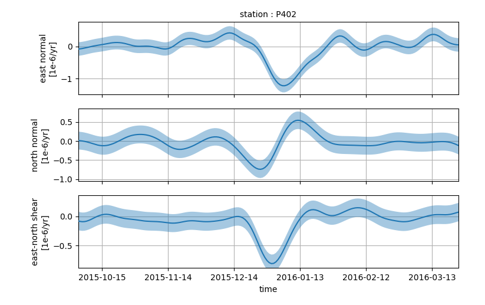

PyGeoNS (Python-based Geodetic Network Strain software)
+++++++++++++++++++++++++++++++++++++++++++++++++++++++
PyGeoNS (pronounced like the bird) is a suite of command line
functions that are used to identify transient strain in GNSS data.
This analysis is performed in a Bayesian framework, using Gaussian
process regression, and thus the results have well-quantified and
meaningful uncertainties. Gaussian process regression is not robust
against outliers, which is a common defect in GNSS data. Thus, PyGeoNS
provides a function for detecting outliers as a pre-processing step.
The outlier detection algorithm flags data which are spatially or
temporally anomalous. PyGeoNS also provides a function for
interactively removing data defects. Lastly, PyGeoNS provides
functions to interactively view the data and results.

Limitations
===========
Gaussian process regression requires solving a system of equations
where the number of unknowns is equal to the number of observations.
Assuming that a high-end desktop computer is being used, this means
that datasets will be limited to several dozen stations and a few
years of daily observations. This limitation can be alleviated to some
extent by using a compact prior covariance function (see below).

PyGeoNS calculates strain on a transverse-mercator projection. It is
assumed that the stations cover a sufficiently small area that such a
projection is appropriate. 

If you want to use Gaussian process regression to analyze your data,
but PyGeoNS is too rigid for your needs, then consider working
directly with the RBF python package (www.github.com/treverhines/RBF).

Installation
============
PyGeoNS requires the standard scientific python packages, which can be
found in the base Anaconda python installation
(www.continuum.io/downloads). Additionally, PyGeoNS require RBF and
scikit sparse. Assuming that Anaconda is already installed, we can
satisfy these dependencies with

.. code-block:: bash

  $ git clone http://www.github.com/treverhines/RBF.git
  $ cd RBF
  $ python setup.py install
  $ cd ..
  $ conda install -c conda-forge scikit-sparse

Once these dependencies are satisfied, PyGeoNS can be downloaded
and installed with the following commands

.. code-block:: bash

  $ git clone http://www.github.com/treverhines/PyGeoNS.git
  $ cd PyGeoNS 
  $ python setup.py install

Demonstration
=============
This demonstration walks through the script ``demo/demo2/run.sh``,
which estimates transient strain resulting from a slow slip event in
Washington. First, navigate to the directory ``demo/demo2``. 

.. code-block:: bash

  $ cd demo/demo2

You will find ``urls.txt`` which contains urls pointing to the GNSS
data that we will use. Lets download the data and save it in the
directory ``work/csv``

.. code-block:: bash

  $ mkdir -p work/csv
  $ for i in `cat urls.txt`
      do
      wget -P 'work/csv' $i
      done
   
Next we merge each data file into one data file that PyGeoNS can read.
This just requires concatenating the files with a ``***`` delimiter.

.. code-block:: bash

  $ sed -s '$a***' work/csv/* | sed '$d' > work/data.csv

Now we are ready to use PyGeoNS. We convert the csv file to an HDF5
file, which is more efficient for i/o.

.. code-block:: bash

  $ pygeons toh5 'work/data.csv' \
                 --file-type 'pbocsv' 

This will generate a file ``work/data.h5``. We can now interactively
view the data file with

.. code-block:: bash

  $ pygeons vector-view 'work/data.h5' \
                        --no-show-vertical \
                        -v

The ``-v`` flag increased the verbosity and caused instructions for
the interactive viewer to be printed to the screen. Use the arrows to
view different stations and times. To keep this demonstration
tractable, we crop the dataset down so that it only spans two years.

.. code-block:: bash

  $ pygeons crop 'work/data.h5' \
                 --start-date '2015-05-01' \
                 --stop-date '2017-05-01'

This produces the file ``work/data.crop.h5``. Next we automatically
identify and remove outliers in the dataset with the command ``pygeons
autoclean``. There are several arguments to this function that should
be tweaked, but we will just use the defaults for now.

.. code-block:: bash

  $ pygeons autoclean 'work/data.crop.h5' -vv

This function will take a few minutes to run. The verbosity has been
increased so that we can see its progress. We can compare the dataset
before and after cleaning by using ``pygeons vector-view`` again.

.. code-block:: bash

  $ pygeons vector-view 'work/data.crop.h5' 'work/data.crop.autoclean.h5' \
                        --no-show-vertical 

We now estimate transient strain from the cleaned GNSS data. Since
PyGeoNS performs Bayesian analysis, we must specify a prior for
transient displacements and a noise model. Our prior is a Gaussian
process with temporal covariance described by a Wendland function and
spatial covariance described by a squared exponential. We also specify
three hyperparameters for the prior. The first describes the standard
deviation of our prior (in mm), the second is a time-scale parameter
(in yr), and the third is a length-scale parameter (in km). The noise
in our data consists of white noise (which we do not need to specify)
and a linear trend that is unique for each station. This linear trend
is secular tectonic deformation, which we are not interested in for
this demonstration. By default, strains will be estimated at the
locations of each station in the dataset and for each day in the
dataset. The computation time can be decreased by specifying a smaller
range of times and positions to output at. Use the ``--start-date``
and ``--end-date`` arguments to set the range of output times. Use the
``--positions`` or ``--positions-file`` to set the output positions.

.. code-block:: bash

  $ pygeons strain 'work/data.crop.autoclean.h5' \
                   --network-prior-model 'spwen12-se' \
                   --network-prior-params 1.0 0.1 100.0 \
                   --station-noise-model 'linear' \
                   --start-date '2015-10-01' \
                   --stop-date '2016-04-01' \
                   -vv

This returns two files, ``work/data.crop.autoclean.strain.dudx.h5``
and ``work/data.crop.autoclean.strain.dudy.h5``, which are the
velocity gradients along the x (east) direction and the y (north)
direction, respectively. Use the ``--no-rate`` flag to return
displacement gradients rather than the velocity gradients. The
deformation gradients can be viewed with ``pygeons vector-view``. We
can also use the deformation gradients to view strain with ``pygeons
strain-view``.

.. code-block:: bash

  $ pygeons strain-view 'work/data.crop.autoclean.strain.dudx.h5' \
                        'work/data.crop.autoclean.strain.dudy.h5' \
                        --scale 20000.0 \
                        --key-magnitude 1.0 \
                        --key-position 0.15 0.85 \
                        -vv

This will open up an interactive viewer for the estimated strain
rates. The following two figures were saved from the interactive
strain viewer. The strain glyphs in the map view figure show the
normal strain rates for all azimuths. Orange indicates compression and
blue indicates extension. The time series figure shows the strain rate
components through time at one station. The shaded regions in both
figures indicate the 68% confidence interval.

The deformation gradients (or any of the intermediary HDF5 files) can
be output to a user-friendly csv file format with the command
``pygeons totext``. The name of the output file (minus the extension)
is specified with the ``--output-stem`` argument

.. code-block:: bash

  $ pygeons totext 'work/data.crop.autoclean.strain.dudx.h5' \
                   --output-stem 'dudx'
  $ pygeons totext 'work/data.crop.autoclean.strain.dudy.h5' \
                   --output-stem 'dudy'

That completes the demonstration. More detailed information about
PyGeoNS can be found below or by calling each PyGeoNS subcommand with
the ``-h`` flag.

Subcommands
===========
PyGeoNS contains the following subcommands. Call these functions with
a ``-h`` flag to see more information.

* ``pygeons toh5`` : Convert data from a text file to an HDF5 file.
* ``pygeons totext`` : Convert data from an HDF5 file to a text file.
* ``pygeons info`` : Display metadata for an HDF5 data file.
* ``pygeons vector-view`` : Interactively view an HDF5 data file or
  multiple data files.
* ``pygeons strain-view`` : Interactively view strain from the
  deformation gradient files, which are the HDF5 files returned by
  ``pygeons strain``.
* ``pygeons reml`` : Estimate prior and noise hyperparameters with the
  restricted maximum likelihood (REML) method.
* ``pygeons strain`` : Estimate transient strain from an HDF5 file of
  displacements. 
* ``pygeons clean`` : Interactively remove jumps and outliers in an
  HDF5 data file. 
* ``pygeons autoclean`` : Automatically remove outliers in an HDF5
  file of displacements.
* ``pygeons crop`` : Spatially and temporally crops an HDF5 data file.
* ``pygeons merge`` : Combine HDF5 data files.

HDF5 Data Format
================
PyGeoNS subcommands mostly read from and write to HDF5 data files. An
HDF5 file can be read using, for example, the h5py package in python.
Each HDF5 file contain the following entries

* ``time`` : Array of unique integers with shape (Nt,). Integer values 
  of modified Julian dates.
* ``id`` : Array of unique strings with shape (Nx,). 4-character IDs 
  for each station.
* ``longitude``, ``latitude`` : Array of floats with shape (Nx,). 
  Coordinates for each station.
* ``east``, ``north``, ``vertical`` : Array of floats with shape 
  (Nt,Nx). These are the data components. The units should be in terms 
  of meters and days and should be consistent with the values 
  specified for ``space_exponent`` and ``time_exponent``. For example, 
  if ``time_exponent`` is -1 and ``space_exponent`` is 1 then the units 
  should be in meters per day. If data is missing for a particular 
  time and station then it should be set to nan.
* ``east_std_dev``, ``north_std_dev``, ``vertical_std_dev`` : Array of 
  floats with shape (Nt,Nx). One standard deviation uncertainties for 
  each component of the data.  The units should be the same as those 
  used for the data components. If data is missing for a particular 
  time and station then it should be set to inf.
* ``time_exponent`` : Integer. This indicates the exponent of the time 
  units for the data. -1 indicates that the data is a rate, -2 indicates 
  an acceleration, etc.
* ``space_exponent`` : Integer. Indicates the exponent of the spatial 
  units for the data.

Text Data Format
================
An HDF5 file can be created from a text file of GNSS data with
``pygeons toh5``. This function is currently able to read three text
file formats: PBO csv files, PBO pos files, and a csv file format
designed for PyGeoNS. To use ``pygeons toh5``, the text files for each
station must be concatenated into a single file with delimiter
``***``. For example, if the data files are in the current directory
and contain a ``.csv`` extension then they can be concatenated with
the following sed incantation

.. code-block::

  $ sed -s '$a***' *.csv | sed '$d' > data.csv 

Next, call ``pygeons toh5`` with the new file name and specify the
file type with ``--file-type``. The file type can be ``csv``,
``pbocsv``, or ``pbopos``.

See www.unavco.org for information on the PBO data file formats. An
example of each file format is provided below.

PBO CSV
-------
.. code-block::

  PBO Station Position Time Series.
  Format Version, 1.2.0
  Reference Frame, NAM08
  4-character ID, P403
  Station name, FloeQuaryGWA2005
  Begin Date, 2005-09-13
  End Date, 2017-01-26
  Release Date, 2017-01-27
  Source file, P403.pbo.nam08.pos
  Offset from source file, 48.54 mm North, 60.55 mm East, -5.06 mm Vertical
  Reference position, 48.0623223017 North Latitude, -124.1408746693 East Longitude, 284.67725 meters elevation
  Date, North (mm), East (mm), Vertical (mm), North Std. Deviation (mm), East Std. Deviation (mm), Vertical Std. Deviation (mm), Quality,  
  2005-09-13,0.00, 0.00, 0.00, 4.71, 3.14, 13.2, repro,
  2005-09-14,7.43, 8.65, 2.37, 1.85, 1.34, 5.6, repro,
  ...
  2017-01-26,98.68, 132.58, 6.00, 1.93, 1.49, 6.34, rapid,

PBO POS
-------
.. code-block::

  PBO Station Position Time Series. Reference Frame : NAM08
  Format Version: 1.1.0
  4-character ID: P403
  Station name  : FloeQuaryGWA2005
  First Epoch   : 20050913 120000
  Last Epoch    : 20170126 120000
  Release Date  : 20170127 235743
  XYZ Reference position :  -2396874.51122 -3534734.44146  4721722.14918 (NAM08)
  NEU Reference position :    48.0623223017  235.8591253307  284.67725 (NAM08/WGS84)
  Start Field Description
  YYYYMMDD      Year, month, day for the given position epoch
  HHMMSS        Hour, minute, second for the given position epoch
  JJJJJ.JJJJJ   Modified Julian day for the given position epoch
  X             X coordinate, Specified Reference Frame, meters
  Y             Y coordinate, Specified Reference Frame, meters
  Z             Z coordinate, Specified Reference Frame, meters
  Sx            Standard deviation of the X position, meters
  Sy            Standard deviation of the Y position, meters
  Sz            Standard deviation of the Z position, meters
  Rxy           Correlation of the X and Y position
  Rxz           Correlation of the X and Z position
  Ryz           Correlation of the Y and Z position
  Nlat          North latitude, WGS-84 ellipsoid, decimal degrees
  Elong         East longitude, WGS-84 ellipsoid, decimal degrees
  Height (Up)   Height relative to WGS-84 ellipsoid, m
  dN            Difference in North component from NEU reference position, meters
  dE            Difference in East component from NEU reference position, meters
  du            Difference in vertical component from NEU reference position, meters
  Sn            Standard deviation of dN, meters
  Se            Standard deviation of dE, meters
  Su            Standard deviation of dU, meters
  Rne           Correlation of dN and dE
  Rnu           Correlation of dN and dU
  Reu           Correlation of dEand dU
  Soln          "rapid", "final", "suppl/suppf", "campd", or "repro" corresponding to products  generated with rapid or final orbit products, in supplemental processing, campaign data processing or reprocessing
  End Field Description
  *YYYYMMDD HHMMSS JJJJJ.JJJJ         X             Y             Z            Sx        Sy       Sz     Rxy   Rxz    Ryz            NLat         Elong         Height         dN        dE        dU         Sn       Se       Su      Rne    Rnu    Reu  Soln
   20050913 120000 53626.5000 -2396874.58357 -3534734.44007  4721722.12054  0.00645  0.00812  0.00994  0.811 -0.686 -0.775      48.0623218656  235.8591245168  284.68231    -0.04854  -0.06055   0.00506    0.00471  0.00314  0.01320  0.163 -0.115 -0.095 repro
   20050914 120000 53627.5000 -2396874.57419 -3534734.44167  4721722.12726  0.00261  0.00353  0.00416  0.793 -0.733 -0.788      48.0623219323  235.8591246330  284.68468    -0.04111  -0.05190   0.00743    0.00185  0.00134  0.00560 -0.002 -0.141 -0.016 repro
   ...
   20170126 120000 57779.5000 -2396874.43473 -3534734.45725  4721722.19088  0.00295  0.00382  0.00479  0.797 -0.776 -0.801      48.0623227520  235.8591262989  284.68831     0.05014   0.07203   0.01106    0.00193  0.00149  0.00634 -0.045 -0.073 -0.110 rapid

PyGeoNS CSV
-----------
The PyGeoNS CSV file only contains information that PyGeoNS uses, 
making it unambigous which fields can influence the results. For 
example, there is no reference frame information in the PyGeoNS csv 
format because PyGeoNS does not ever use that information.

.. code-block::

  4-character id, P403
  begin date, 2005-09-13
  end date, 2017-01-26
  longitude, 235.859125331 E
  latitude, 48.0623223017 N
  units, meters**1 days**0
  date, north, east, vertical, north std. deviation, east std. deviation, vertical std. deviation
  2005-09-13, -4.854000e-02, -6.055000e-02, 5.060000e-03, 4.710000e-03, 3.140000e-03, 1.320000e-02
  2005-09-14, -4.111000e-02, -5.190000e-02, 7.430000e-03, 1.850000e-03, 1.340000e-03, 5.600000e-03
  ...
  2017-01-26, 5.014000e-02, 7.203000e-02, 1.106000e-02, 1.930000e-03, 1.490000e-03, 6.340000e-03

Network and Station Processes
=============================
The subcommands ``pygeons strain``, ``pygeons autoclean``, and
``pygeons reml`` require the user to specify Gaussian processes,
either as a prior model or a noise model. PyGeoNS distinguishes
Gaussian processes at either "network" processes, which are spatially
and temporally correlated, or "station" processes, which are only
temporally correlated. The processes may contain hyperparameters that
the user must also specify. Some of the available processes and their
corresponding hyperparameters are documented below

Network Processes
-----------------
* ``wen12-se`` : Temporal covariance is described by a Wendland
  function. Spatial covariance is described by a squared exponential.
  Requires three hyperparameters to be specified : standard deviation
  (mm), characteristic time-scale (yr), and characteristic
  length-scale (km). :math:`x` :math:`test` 
  test 
  test

  test

* ``spwen12-se`` : Same as ``wen12-se`` but covariance matrices are
  treated as sparse.
* ``se-se`` : Temporal covariance is described by a squared
  exponential. Spatial covariance is described by a squared
  exponential. Requires three hyperparameters to be specified :
  standard deviation (mm), characteristic time-scale (yr), and
  characteristic length-scale (km).
* ``ibm-se`` : Temporal covariance is described by integrated
  brownian motion. Spatial covariance is described by a squared
  exponential. Requires three hyperparameters to be specified :
  standard deviation of the forcing term (mm/yr^1.5), reference time
  (mjd), and characteristic length-scale (km).

Station Processes
-----------------
* ``fogm`` : Covariance is described by a first-order Gauss-Markov
  process. Requires two hyperparameters to be specified : standard
  deviation of the forcing term (mm/yr^0.5) and cutoff frequency
  (1/yr).
* ``bm`` : Covariance is described by Brownian motion. Requires two
  hyperparameters to be specified : standard deviation of the forcing
  term (mm/yr^0.5) and reference time (mjd).
* ``linear`` : Unconstrained offset and linear trend. Requires no
  hyperparameters to be specified.
* ``per`` : Unconstrained annual and semiannual sinusoids. Requires no
  hyperparameters to be specified.

Examples
--------
``pygeons autoclean`` and ``pygeons reml`` require the user to specify
some combination of network and station processes to describe the
data. Suppose we want to clean the displacements saved in ``data.h5``.
We expect that the data consists of a ``se-se`` network process with
hyperparameters 1.0 mm, 0.1 yr, and 100.0 km. We also expect each
station to have an independent offset and linear trend. We can clean
the data with the command

.. code-block:: bash

  $ pygeons autoclean data.h5 \
                      --network-model 'se-se' \
                      --network-params 1.0 0.1 100.0 \
                      --station-model 'linear' \
                      --station-params 

We can also specify multiple network and station processes to combine
them. Suppose we also expect periodic deformation and a FOGM process
at each station. We can then clean the data with the modified command

.. code-block:: bash

  $ pygeons autoclean data.h5 \
                      --network-model 'se-se' \
                      --network-params 1.0 0.1 100.0 \
                      --station-model 'linear' 'per' 'fogm' \
                      --station-params 0.5 0.01

``pygeons strain`` also requires the user to distinguish processes as
being part of the prior or part of the noise. Hence, the models are
specified as ``--network-prior-model``, ``--network-noise-model``, and
``--station-noise-model``. There is no ``--station-prior-model``
argument because the prior must be spatially and temporally
continuous.

Bugs, Comments, or Suggestions
==============================
Please report any issues at www.github.com/treverhines/PyGeoNS/issues.  

